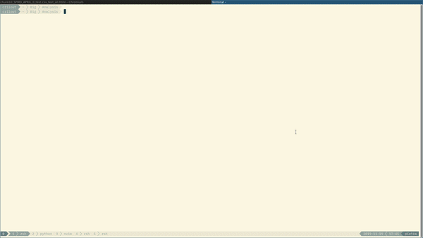

# README #

Run: chmod u+x launch.sh && ./launch.sh

### What is this repository for? ###

This repository is for desktop configuration. It contains all my dotfiles.

# How it looks

Here you can see how it looks when you have termite/neovim with all bundles/tmux well configured.
Enjoy ! :)

